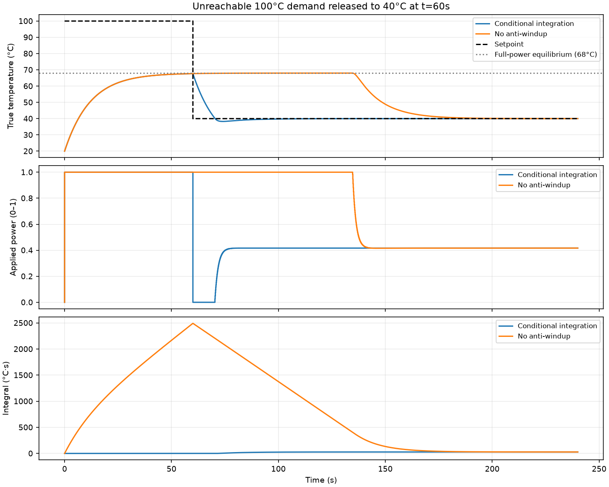
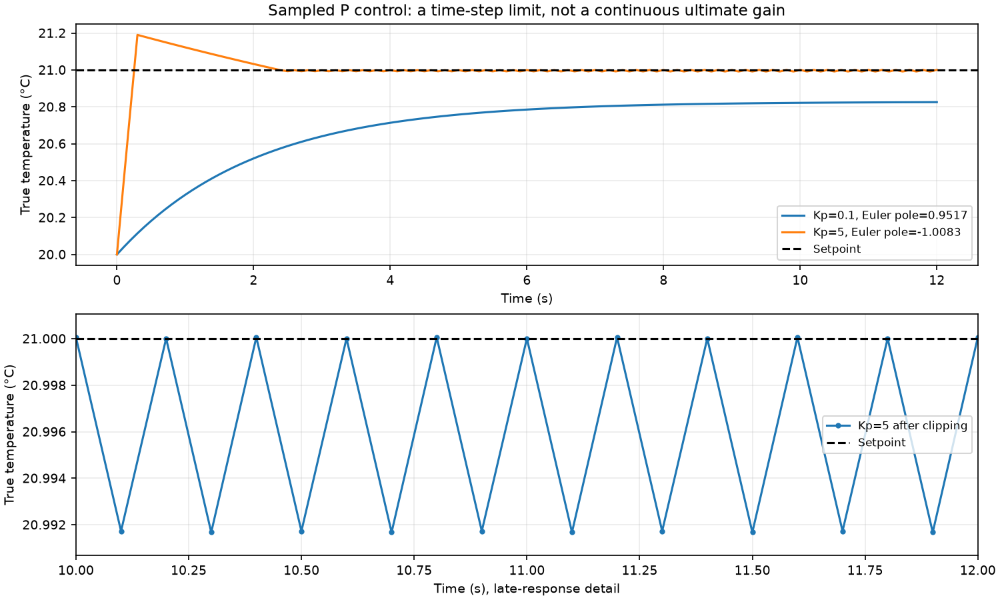

# PID-controlled thermal system

An educational sampled-data heating simulation with a first-order plant, bounded
actuator, conditional-integration anti-windup, seeded sensor noise and exportable
experiments. The tests compare the simulation with independent continuous-time
solutions and check recovery after saturation. This is a model study, not a
validated hardware controller or an automatic tuning tool.

## Reproduce the results

Use Python 3.12. From the repository root:

```bash
python -m venv .venv
# Windows:
.venv\Scripts\python -m pip install -r requirements-dev.txt
.venv\Scripts\python -m pytest -q
.venv\Scripts\python demo.py

# Linux/macOS:
.venv/bin/python -m pip install -r requirements-dev.txt
.venv/bin/python -m pytest -q
.venv/bin/python demo.py
```

The demo runs without a display and writes seven PNG/SVG figures to `images/`,
the complete numerical report to `results/metrics.json`, and eleven trace CSVs
to `results/`. CSVs are generated rather than committed. To keep the checked-in
snapshots untouched, use `python demo.py --output-dir build/demo`. Add `--show`
to display the figures, or select one with `--experiment baseline_pid`.
Matplotlib's local font cache is stored under `build/`, not the home directory.
Dependencies are pinned; transitive packages and platform fonts may still affect
binary figure identity across environments. The physical traces do not depend
on NumPy or Matplotlib. CI runs the tests and the headless exporter on Python 3.12,
then uploads figures, CSVs and metrics as an artifact.

## Plant, units and sampling

```text
dT/dt = -(T - T_ambient)/tau + gain*u
T[n+1] = T[n] + dt * (-(T[n] - T_ambient)/tau + gain*u[n])
```

| Quantity | Default | Units |
|---|---:|---|
| Ambient temperature | 20 | °C |
| Thermal time constant `tau` | 12 | s |
| Heater `gain` | 4 | °C/s per unit power |
| Controller sample interval `dt` | 0.1 | s |
| Applied heater command `u` | 0–1 | Dimensionless fraction of full power |
| Optional slew limit | 0.1 | Power units/s; 0.01 per 0.1s sample |
| Nominal `Kp`, `Ki`, `Kd` | 0.18, 0.015, 0.03 | 1/°C, 1/(°C·s), s/°C |

The full-power equilibrium is `20 + 4*12 = 68°C`. The heater cannot actively cool
or maintain a temperature below ambient. Holding 50°C requires power
`(50-20)/(4*12) = 0.625`. A 100°C demand is therefore deliberately unreachable.

The physical state advances once per sample using forward Euler. `dt <= tau` is
required for a monotone open-loop update; controller stability can require a much
smaller timestep. The controller reads the sensor at `t`, applies power over
`[t,t+dt)`, and records the resulting physical state at `t+dt`. CSV `applied_power`
at row `n` is the command used over `(time[n-1],time[n]]`; the initial row has no
preceding interval. Setpoint steps are recorded at the exact boundary.

Gaussian noise is added only when reading the sensor. It never changes the plant
temperature. Each plant has its own seeded RNG. Noiseless experiments provide
reference responses; the filter comparison uses standard deviation 0.5°C and
seed 7, with identical noise innovations in both runs. The 10-sample moving
average uses its actual sample count during warm-up and introduces about 0.45s
of group delay when full. Filtering can reduce noise and actuator chatter while
also reducing stability margin; it is not universally beneficial.

## Controller and saturation

```text
e[n] = setpoint[n] - measurement[n]
D[n] = -(measurement[n] - measurement[n-1]) / dt
requested = Kp*e + Ki*integral + Kd*D
applied = magnitude_and_slew_limit(requested)
```

Derivative on measurement avoids an artificial kick when only the setpoint
changes; the first derivative sample is zero. `PID.compute()` returns the applied
bounded command, so callers do not need another clamp. `raw_output` exposes the
request for inspection. Rate limiting is inside the controller so anti-windup
uses the command the plant actually receives.

Conditional integration examines the **current** requested/applied difference.
It accepts `error*dt` if the command can be applied or if the integral increment
moves the request toward the applied value. Outward accumulation freezes during
magnitude or slew saturation; inward error can unwind at either bound. Testing
the proposed increment instead would prevent a pure-I controller from ever
starting when its first increment crosses a limit. As with this sampled
conditional method, one increment beyond a limit can remain; this is not
back-calculation or exact projection. The integral has units °C·s and has no
arbitrary ±10 clamp. `anti_windup=False` is provided for the comparison, not as
the default. Reset clears history and starts the actuator at its lower limit.

## Measured results

The checked-in [numerical report](results/metrics.json) and plots are generated
by `demo.py`. Nominal results use a noiseless 20→50°C step, 180s duration and
the gains above. These gains are a conservative example for this plant, not a
claim of an optimal tuning.

| Controller | Overshoot | Settling time | Final 10s mean error |
|---|---:|---:|---:|
| P (`Kp=0.18`) | 0°C | Not within band | +3.112°C |
| PI | 0°C | 28.8s | +0.000003°C |
| PID | 0°C | 28.1s | +0.000003°C |
| PID with 0.1/s slew limit | 0°C | 34.6s | +0.000004°C |

Settling is the first sample after which **all remaining samples** stay within
2% of the initial true-temperature-to-target displacement, with a 0.1°C minimum
band. Here the band is ±0.6°C. Overshoot follows the step direction: for a falling
step it means undershoot below the target. Steady-state error is target minus
mean true temperature in the last 10s. Small printed errors describe this finite,
noiseless numerical experiment; they are not sensor or real hardware accuracy.
Settling is limited to the observation horizon and is `null` when not attained.


The unreachable-demand experiment holds 100°C for 60s, then requests 40°C.
Conditional integration settles in **29.2s after release**, with 1.729°C falling
step overshoot. Disabling anti-windup takes **123.0s**; after 60s of recovery it
is still above 67°C. The bounded actuator is identical in both runs, isolating
the effect of integral accumulation. Anti-windup improves recovery here without
eliminating every transient.



For the seeded noisy comparison, feedback RMS error against the true state over
150–180s falls from **0.527°C to 0.216°C**. Heater total variation in that window
falls from **120.02 to 9.84 power units** (sum of absolute sample changes).
Both are scenario-specific measurements; filtering also changes the closed-loop
trajectory and adds delay.


## Analytical verification and tuning limitation

For constant power, the exact continuous solution is
`T(t)=20+48*u*(1-exp(-t/12))`. Halving Euler's timestep halves the numerical error.
For unsaturated P control the pole is `-(1/tau + gain*Kp)` and steady-state error
is `(setpoint-ambient)/(1+gain*tau*Kp)`. Tests compare both the transient and
equilibrium against those formulas, rather than another implementation of the
same recurrence. For PI they independently solve
`y''+(1/tau+gain*Kp)*y'+gain*Ki*y = gain*Ki*R`, with
`y(0)=0`, `y'(0)=gain*Kp*R`, and check first-order timestep convergence while
verifying that the actuator is unsaturated. Additional checks cover reachable
and unreachable saturation release, pure-I startup, thermal bounds, final heater
power, sensor/state separation, filtering time alignment and measured metrics.

This delay-free continuous first-order plant has **no finite ultimate P gain**:
its P-controlled pole stays negative for every nonnegative `Kp`. It cannot
produce the marginal continuous oscillation required by the Ziegler–Nichols
ultimate-gain experiment. This follows directly from the pole above; the
[University of Michigan lightbulb control tutorial](https://ctms.engin.umich.edu/CTMS/index.php?aux=Activities_Lightbulb)
uses the same first-order pole argument. For the ultimate-gain method and its
critical oscillation requirement, see Åström and Murray,
[Feedback Systems, PID Control](https://www.cds.caltech.edu/~murray/books/AM08/pdf/fbs-pid_01Jan19.pdf).

Euler sampled P control instead has pole `1-dt*(1/tau+gain*Kp)`, so at `dt=0.1s`
its unsaturated linear stability requires `Kp < 4.97917`. The Kp=5 plot illustrates
a discrete sampling instability; clipping makes the nonlinear trace bounded but
does not establish linear stability. That oscillation is not a valid continuous
`Ku/Tu`. The retained `ziegler_nichols_demo.py` filename now explains this
limitation; the old invented tuning and plot were removed.



## Interactive examples and model limits

After activating the environment, `main.py`, `step_response.py`,
`compare_pid_modes.py`, `filtered_control.py`, `ramp_limited_heater.py` and
`ziegler_nichols_demo.py` display the corresponding experiment. All use the same
simulation engine. `realtime_animation.py` replays a seeded 60s simulation at
10Hz; redraws and repeated frames never advance the model. It is a visualization,
not a real-time hardware scheduler. There is no interactive tuning script.

The model omits dead time, spatial heat flow, changing ambient temperature,
nonlinear heater behavior, process disturbances and hardware constraints beyond
power/slew limits. Noise is Gaussian, uncorrelated measurement noise. No gain
robustness claim is made outside the tested plant and timestep ranges. In this
simple plant PI already works well; PID is retained to study derivative feedback
and its noise sensitivity.
