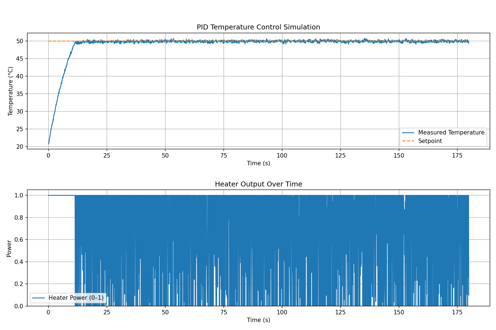
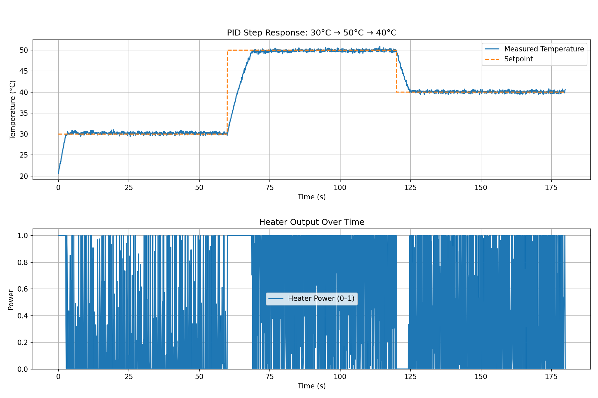
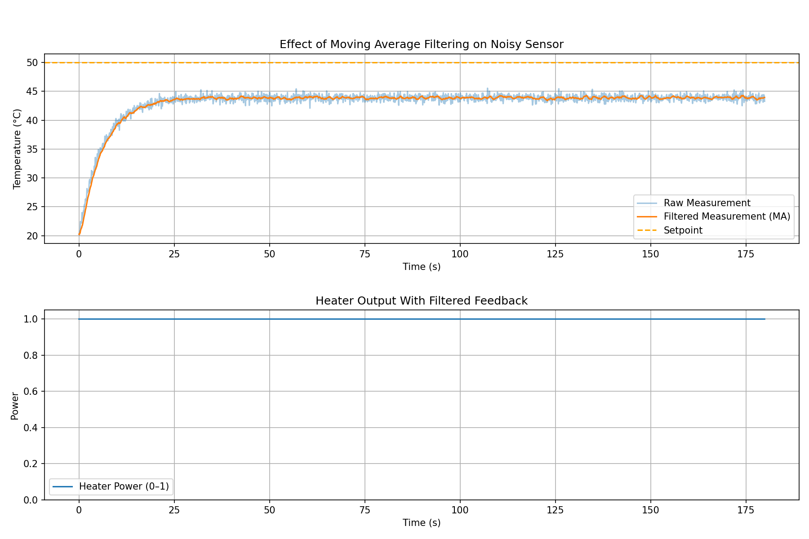
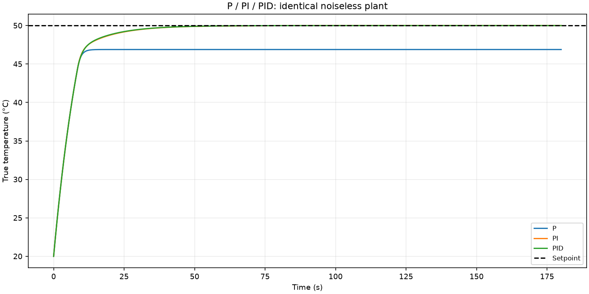
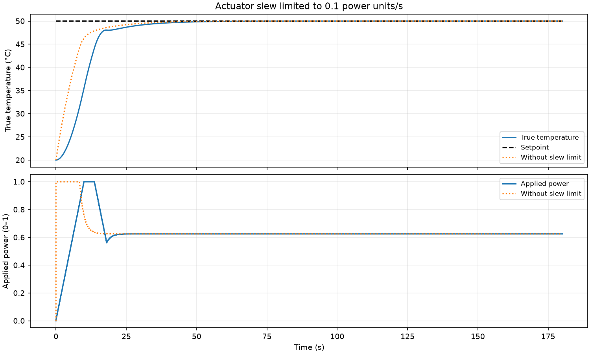
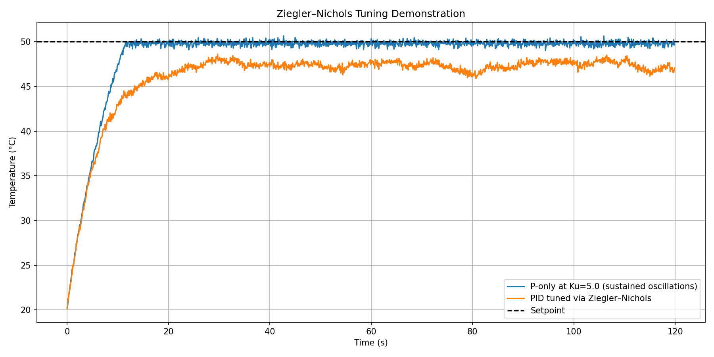

# PID-Controlled Thermal System Simulation

This project simulates a PID controlled heating system commonly found in industrial or telecom hardware.

It includes:

- A simple first order thermal plant
- A digital PID controller with anti windup
- Actuator saturation and ramp rate limits
- Noisy sensor measurements and digital filtering
- Multiple experiments commonly used in control engineering

---

# System Overview

## Thermal Plant

The plant is a simple first order model:

dT/dt = -(T - T_ambient) / tau + K * u

where:

- T is the temperature
- T_ambient is ambient temperature (20 °C)
- tau is the thermal time constant
- K is the heater gain
- u in [0, 1] is the heater power command

Gaussian noise is added to simulate imperfect temperature sensing.

## PID Controller (with anti windup)

The controller computes:

u = Kp * e + Ki * integral(e) + Kd * de/dt

with:

- Integral clamping to prevent windup
- Conditional integration when the actuator is saturated
- Output clamped to [0, 1] to represent a real heater

---

## Block Diagram

   ```text
+----------------------------+
|        PID Controller      |
|  (Kp, Ki, Kd, anti windup) |    heater_power (0..1)
setpoint ----->(+)-------------->-------------------+
                ^                                   |
                |                                   v
                |   +-----------------------------+      measured
                |   |   Thermal System (Plant)    |      temperature
                +---|  First order model + noise  |<-----------+
                    +-----------------------------+

With filtering enabled:

     measured temp
           |
           v
    +-------------+      filtered temp
    |   Filter    |--------------------> PID
    | moving avg  |
    +-------------+
```
---

# Example Results

### Baseline PID Closed Loop



### Step Response: 30°C -> 50°C -> 40°C



### Noisy Sensor with Moving Average Filtering



### P vs PI vs PID Comparison



### Actuator Ramp Rate Limiting



### Ziegler–Nichols Tuning Demonstration



---

# How to Run the Simulations

From the project root:

```bash
python main.py
python step_response.py
python filtered_control.py
python compare_pid_modes.py
python ramp_limited_heater.py
python ziegler_nichols_demo.py
python interactive_pid_tuning.py
python realtime_animation.py

Project Structure

pid-control-simulation/
├── controller/
│   ├── __init__.py
│   └── pid.py
├── system/
│   ├── __init__.py
│   └── system_model.py
├── utils/
│   ├── __init__.py
│   └── filtering.py
├── images/                    # auto generated plots
├── main.py
├── step_response.py
├── filtered_control.py
├── compare_pid_modes.py
├── ramp_limited_heater.py
├── ziegler_nichols_demo.py
├── interactive_pid_tuning.py
└── realtime_animation.py

